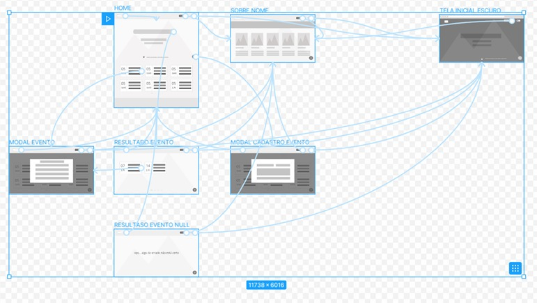
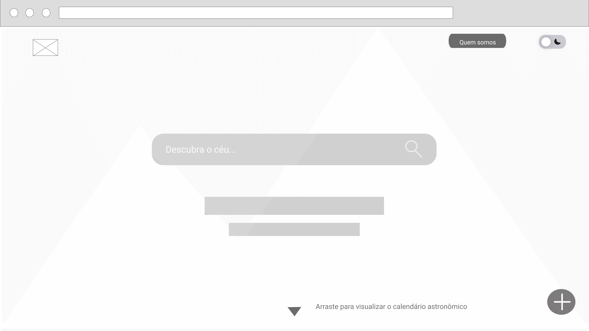
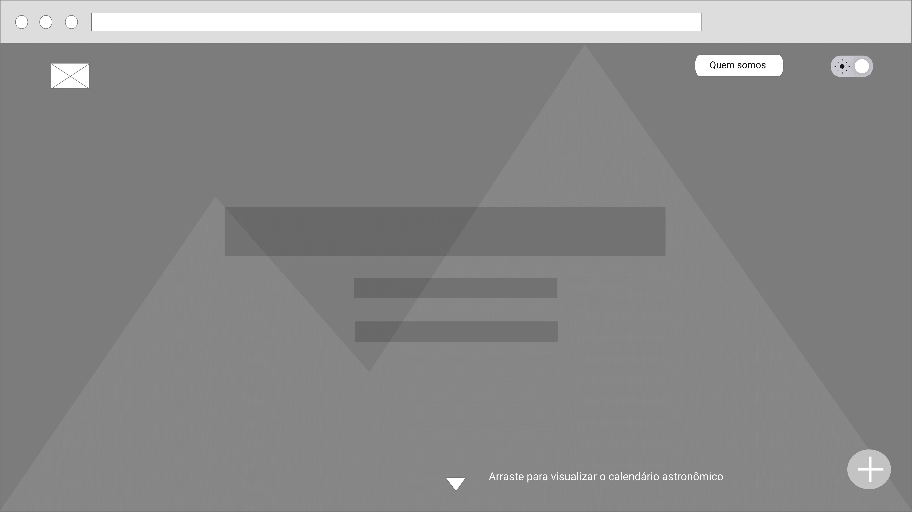
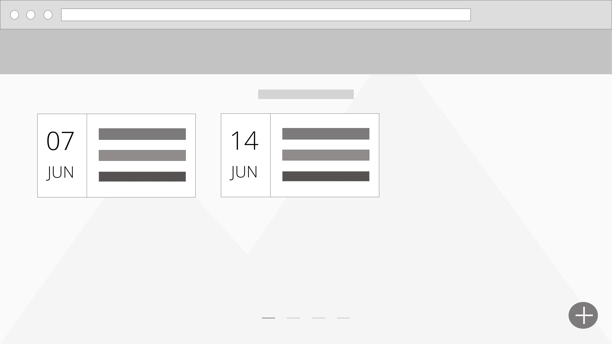
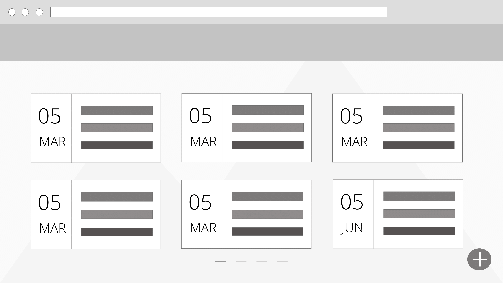
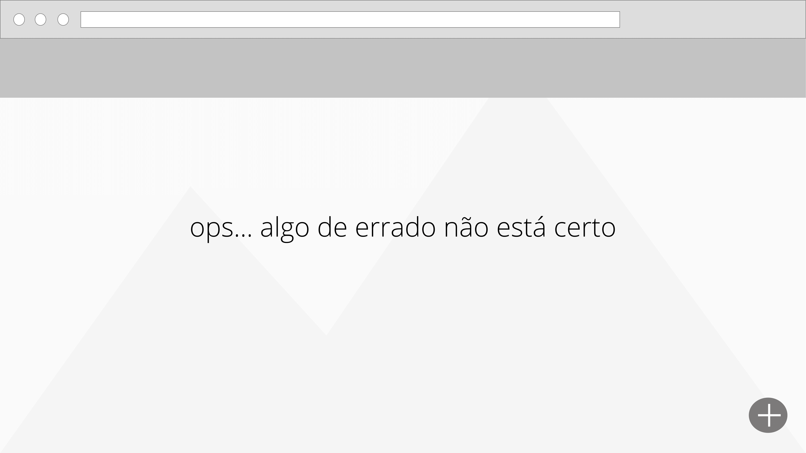
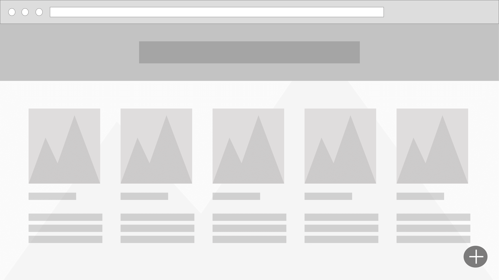
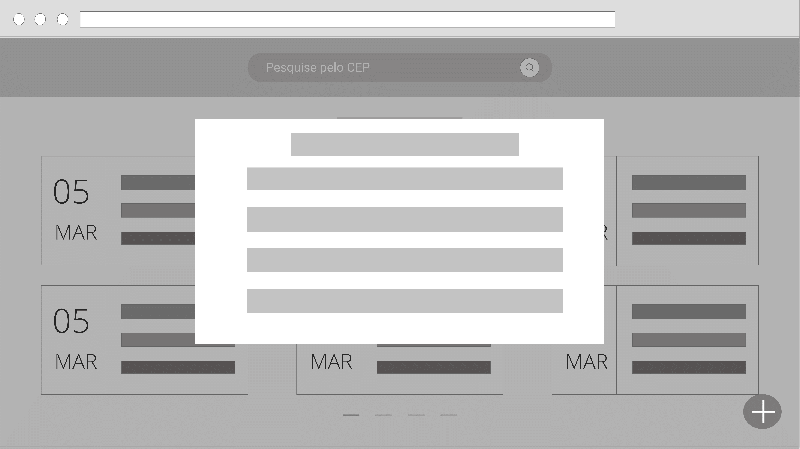
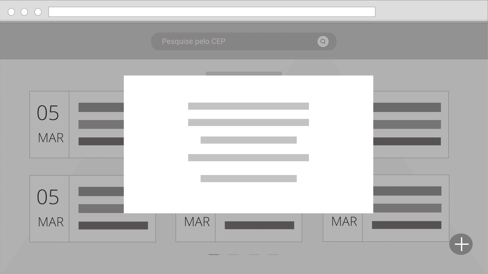

# Projeto de Interface

Permitindo ao usuário o acesso a interfaces de forma simples e intuitiva, a aplicação web possui em sua tela inicial as seguintes opções de interações:

-   a possibilidade de alternar a visualização da interface entre  Light and Dark Mode;
    
-   a possibilidade de acessar informações sobre o projeto e sobre os desenvolvedores do mesmo;
    
-   a possibilidade de pesquisar por palavras-chaves das ocorrências cadastradas;
    
-   a possibilidade de cadastrar e visualizar as ocorrências astronômicas;
    
A alteração do modo de tela é realizada por meio da interação com um toggle no canto direito superior da tela, preenchendo assim o requisito funcional de alteração do modo de tela diurno para noturno e vice e versa.

Já as informações sobre o projeto e seus desenvolvedores poderão ser acessadas por meio do botão “Quem somos” que ao ser clicado levará o usuário a uma nova tela com as respectivas informações. Sendo assim preenchido o requisito funcional de acesso a informações do projeto.

A pesquisa de ocorrências astronômicas por meio do uso de palavras-chaves será realizada a partir da inserção do conteúdo na caixa de busca presente na página inicial. Sendo assim preenchido o requisito funcional de pesquisa por palavras-chaves do projeto.

Em todas as telas será possível interagir com o botão de cadastro. Ao ser clicado, o botão abrirá um modal para a exibição do processo de cadastro referente às ocorrências astronômicas, preenchendo assim o requisito funcional referente a possibilidade de cadastro das ocorrências.

Ao utilizar o scroll inferior na tela inicial o usuário passa a ter acesso a todas as ocorrências astronômicas cadastradas, preenchendo o requisito funcional de possibilidade de visualizar o calendário astronômico

## User Flow

- [Visualização do User Flow [Figma]](https://www.figma.com/file/e2xLvJeBT8MkIvzJEVMXGF/UI-Design?node-id=0%3A1)

## Wireframes

- [Visualização do Wireframe[Figma]](https://www.figma.com/file/e2xLvJeBT8MkIvzJEVMXGF/UI-Design?node-id=0%3A1)