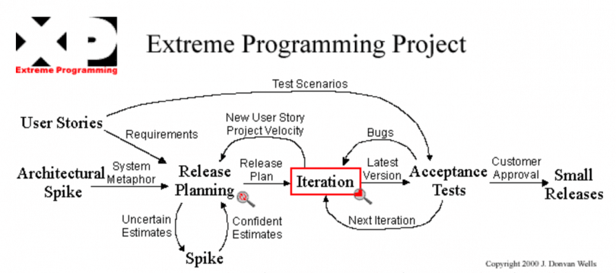

# Metodologia

No desenvolvimento do projeto em questão, sera utilizado uma combinação de práticas ágeis afim de se obter uma melhor produtividade e qualidade do produto.

- `Extreme Programming (XP): `Foi criado por Kent Beck, Ward Chunningham e Ron Jeffries durante a década de 90. Eles se juntaram para criar uma metodologia ágil que lidasse bem com requisitos vagos que mudavam frequentemente, equipes pequenas e que ao inves de ser focado em criar artefatos burocraticos focasse no desenvolvimento. O XP é uma metodologia ágil focada em qualidade de código, teste e outras boas práticas de engenharia.

- `Kanban: `Foi criado originalmente pela Toyota (montadora de carros), posteriormente David Anderson nos anos 2000 aprimorou esta metodologia visando gestão de fluxo das empresas. O Kanban trabalha em cima dos conceitos de manufatura Lean promovendo uma autonomia e transparencia no ciclo de desenvolvimento.

## Controle de Versão

A ferramenta de controle de versão adotada no projeto foi o
[Git](https://git-scm.com/), sendo que o [Github](https://github.com)
foi utilizado para hospedagem do repositório.

O projeto segue a seguinte convenção para o nome de branchs:

- `master`: versão estável já testada do software
- `feature/develop`: versão já testada do software, porém instável
- `feature/card`: versão de desenvolvimento do software

Quanto à gerência de issues, o projeto adota a seguinte convenção para
etiquetas:

- `memo`: melhorias ou acréscimos à documentação
- `bug`: uma funcionalidade encontra-se com problemas
- `enhancement`: uma funcionalidade precisa ser melhorada
- `feature`: uma nova funcionalidade precisa ser introduzida

## Gerenciamento de Projeto

### Divisão de Papéis

<table>
    <tr>
        <th>Product Manager</th>
        <th>Full Stack 1</th>
        <th>Full Stack 2</th>
        <th>Full Stack 3</th>
        <th>Full Stack 4</th>
    </tr>
    <tr>
        <td>Ana Luiza Lima</td>
        <td>Déborah Souza</td>
        <td>Erick Ribeiro</td>
        <td>Paulo Henrique</td>
        <td>Thais Silva</td>
    </tr>
</table>

### Processo

As reuniões são realizadas de forma periódica seguindo o processo XP.

- `Daily & Iteration` realizada diariamente as 19:30
- `Planejamento de Release` realizada semanalmente as terças-feiras as 21:00
- `Retrospectivas` acontecem de acordo com as entregas

- `Board de Atividade` artefato originário do Kanban

Para a gestão das TASK's será utilizado o board de atividade para que possa ser visualizado o fluxo das tarefas.

Os requisitos que serão implementados deverão ser escritos em user story.

- `Usery Story` artefato originário do XP

### Ferramentas

As ferramentas empregadas no projeto são:

<ul>
    <li>Visual Studo ou qualquer outro editor de texto;</li>
    <li>Teams (Canal de comunicação oficial do curso);</li>
    <li>WhatsApp (Canal de comunicação informal e rápida do time);</li>
    <li>Figma, AdobeXD e Axure(Ferramenta para Prototipar nossas interfaces);</li>
    <li>Flow Chart (Ferramenta usada pala elaborar nosso diagrama e arquitetura);</li>
    <li>Miro (Ferramenta utilizada para centralizar as ideias estabelecidas durantes as call);</li>
    <li>GitHub (Ferramenta utilizada para gerenciamento e versionamento do Projeto);</li>
</ul>
